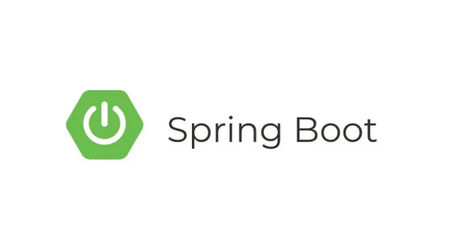

# Pet Clinic

## 0 - mise en place

Faire un fork du projet pet-clinic (voir avec le formateur).

Changer le nom du projet en `spring-pet-clinic-<votre_nom>` et n'oubliez pas de sélectionner le bon namespace (votre numéro de POEI + spring => zenika-academy/zacademy-promo-09/spring).

Installez un client HTTP sur votre poste:

- Installez postman sur vos postes <https://www.postman.com/downloads/>
- Installez insomnia sur vos postes <https://insomnia.rest/>

## 1 - Créez les requêtes HTTP

En inspectant le code récupéré, essayez de:

- Ajouter des cliniques
- Récupérer les cliniques créées

## 2 - Ajoutez un logger dans PetClinicController

- Un logger avec `slf4j` dans une application `Spring boot` s'ajoute comme suit :

```java
private static final Logger logger = LoggerFactory.getLogger(ECRIRE_ICI_LA_CLASSE_DANS_LAQUELLE_LE_LOGGER_EST_AJOUTé.class);
```

Dans le controller:

- Ajoutez un log sur la création d'une clinique

Appelez le endpoint via votre **client HTTP**:

- Vérifiez que le log apparaît dans la console
- Regardez toutes les informations ajoutées

Comparez avec la sortie d'un `System.out.println`, et se promettre à soi-même qu'on ne l'utilisera plus ! ;)

Ajouter une méthode toString() à la classe `PetClinicDto`
Ajoutez dans le log, l'objet `PetClinicDto` de la façon suivante:

```java
logger.info("un texte bien choisi et explicatif. Auquel on peut ajouter un objet {}", monObjetQueJeVeuxLog);
```

Dans la suite, pour mieux comprendre ce qu'il se passe dans l'application, penser à **ajouter des logs**. Et si vous avez un souci, passez en mode **debug**.

## 3 - Ajoutez un identifiant technique à PetClinic

Ajoutez un nouvel attribut `id` à l'objet PetClinic. Cette identifiant doit être géré lors de la création d'une clinique. (Pas insérable / modifiable par l'utilisateur)

Astuce pour obtenir un id entier, supérieur à tous ceux déjà dans notre liste petClinicDtoList

```java
    private int getNextId() {
        final int nextId;
        if (petClinicDtoList.isEmpty()) {
            nextId = 1;
        } else {
            nextId = Collections.max(petClinicDtoList.stream()
                        .map(PetClinicDto::getId).toList()) + 1;
        }
        return nextId;
    }
```

Retournez comme réponse à la création d'une clinique, l'identifiant généré.

## 4 - Faire un découpage en couche

- Créez le package `service`
- Ajoutez un nouveau service pour `petClinicService`
- Utilisez l'injection de dépendance pour injecter le service `petClinicService` dans la couche controller `petClinicController`
- Déplacez la liste de `petClinic` dans la **couche service**
- Utilisez l'annotation `@Service`, plutôt que `@Component`

## 5 - Utilisez des objets différents dans la couche controller et service

- Créez une classe `PetClinic` (non suffixé par Dto), avec les mêmes attributs de `PetClinicDto`
- Créez une classe `PetClinicMapper`, faire de cette classe un bean (@Component)
- Y ajouter une méthode `petClinicDtoToPetClinic` qui prend un `petClinicDto`, et qui retourne un `PetClinic` dans lequel on a copié la valeur de tous les attributs
- Y ajouter une méthode `petClinicToPetClinicDto` qui fait l'opération inverse `PetClinic` -> `petClinicDto`
- Injectez ce bean `PetClinicMapper` dans le controller, et convertir les `PetClinicDto` en `PetClinic` avant de les donner au service
- Modifiez le service pour n'utiliser que des `PetClinic`

## 6 - Implémentez un CRUD complet de PetClinic

```
    GET /pet-clinics -- extraction de tous les cliniques. (déjà implémenté)
    GET /pet-clinics/1 -- extraction de la clinique ayant l'identifiant 1.
    DELETE /pet-clinics/1 -- suppression de la clinique 1.
    POST /pet-clinics -- création d'une nouvelle clinique. (déjà implémenté)
    PUT /pet-clinics/1 -- mise à jour de la clinique 1.
```

Annotations nécessaires :

- @GetMapping, @DeleteMapping, @PostMapping, @PutMapping
- @PathVariable
- @RequestBody

## 8 - Choisir les codes HTTP que l'on souhaite retourner

Dans un **RestController**, en faisant retourner un `ResponseEntity<UnObjet>`, plutôt que simplement `UnObjet`, on peut choisir le **code HTTP retourné**.

Exemple pour la méthode pour créer une clinique :

Le code HTTP de retour après la création d'une ressource est 201 (CREATED). Pour retourner un tel code http, utiliser le code java suivant :

```java
ResponseEntity.status(HttpStatus.CREATED).body(id);
```

## 9 - Le métier veut des règles de gestion

Le métier ne veut **plus de clinique avec le même nom**

- Implémentez cette règle de gestion
- Retournez un code http 400 (BAD REQUEST) dans le cas d'un ajout de clinique avec un nom existant

## 10 - On souhaite ajouter une nouvelle ressource owner (= propriétaire)

- Créez un nouveau controller `OwnerController` sur le path `/owners`
- Créez des classes `OwnerDto` et `Owner`, ayant des attributs name, id et petClinicId, pour les couches controller et service
- Créez une classe `OwnerMapper` avec 2 méthodes pour convertir de `OwnerDto` en `Owner` et inversement
- Ajoutez un service, ayant un attribut `ownerList` pour stocker ces propriétaires
- Implémentez un CRUD en REST dans le `OwnerController`
- Le métier veut une nouvelle règle de gestion ... Le `petClinicId` du owner doit correspondre à une **clinique qui existe**.

## 11 - On souhaite retourner lors des lectures (GET) des cliniques également leurs propriétaires

- Ajoutez un attribut `ownerList` à la classe `PetClinicCto`
- Dans le `PetClinicController`, valoriser cet attribut `ownerList`, en récupérant les **owner de la clinique**
- Valorisez cet attribut avec la liste des propriétaires de la clinique

## 12 - Suite "Le métier ne veut pas de propriétaire dont la clinique n'existe pas"

Avez-vous pensé à supprimer les propriétaires lors de la suppression d'une clinique ? :O

## 13 - Sur le endpoint qui retourne toutes les cliniques, on souhaite pouvoir faire de l'auto-complétion sur le nom

Proposez la possibilité (facultative) d'ajouter un queryParam `nameAutocomplete` sur le GET qui retourne la liste des cliniques.

La présence de ce `nameAutocomplete`, ne retourne que les cliniques dont le nom commence par la valeur passée dans ce paramètre.

Information pour gérer les `queryParam`: <https://www.baeldung.com/spring-request-param>

## 14 - Ajoutez une contrainte pour ne plus accepter de clinique avec un nom vide

Grâce à la librairie `hibernate-validator` (à ajouter dans les dépendances dans le pom.xml), on souhaite ne plus accepter de clinique avec un nom vide.

Faire des recherches sur l'utilisation de cette librairie pour avoir cette contrainte.
<https://hibernate.org/validator/>

## 15 - On souhaite gérer des retours en erreur client 4xx

Choisir la solution "Solution 4: ResponseStatusException (Spring 5 and Above)" du lien suivant :
<https://www.baeldung.com/exception-handling-for-rest-with-spring#responsestatusexception>

Utiliser cette manière de faire pour retourner :

- un code HTTP 404 si le endpoint `GET /pet-clinics/1` correspond à un id qui n'existe pas
- un code HTTP 400 si le endpoint `PUT /pet-clinics/1` correspond à un id qui n'existe pas (une ressource ne sera modifiable que s'elle a été créée précédemment)

## 16 - On souhaite log le temps d'exécution du traitement de la requête de création d'une clinique

- Dans le controller `PetClinicController`, ajouter un log qui mesure le temps de traitement de la création d'une clinique en milliseconde
- Exemple souhaité dans les logs : `La création de la clinique a duré 10ms`

### BONUS : test d'intégration

Ajoutez les tests pour les différentes ressources.

### BONUS : utiliser Spring AOP

Warning : beaucoup de recherches google vont être nécessaires

- utilisez spring-boot-starter-aop pour ajouter un log "request received" avant tout appel à une méthode d'un de nos controller
- utilisez spring-boot-starter-aop pour ajouter un log qui mesure le temps d'exécution de tous les appels reçus à nos controllers
